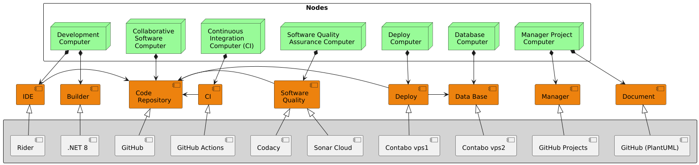

# Web System for Management of Colegio Bautista Libertad Documentation

Sistema web para la gestión del Colegio Bautista Libertad

---

# Main index

Modelo de documentación de proyecto, siguiendo el modelo "4 + 1 vista",

* [Use Case View ⮞](Review/usecase-view.md)

* [Design View ⮞](Review/design-view.md)

* [Process View ⮞](Review/process-view.md)

## 1. Domain model
Sección donde se muestran los datos relevantes del modelo del dominio.

### 1.1 Organigrama

### 1.2 Modelo del negocio

## 2. Ecosystem

