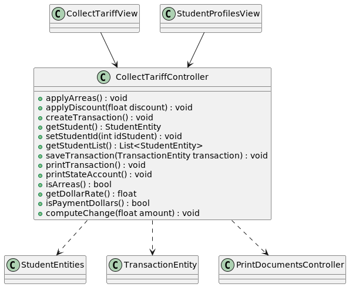
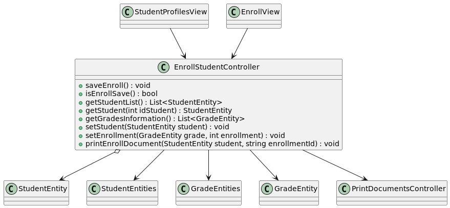

[🢀 Back to Analysis view](./analysis-view.md)

Análisis de clases.

## Indice

- [Controllers](#control)
    - [CollectTariffController](#control0)
    - [EnrollStudentController](#control1)

---

## Controllers 

* ### CollectTariffController 

* ### EnrollStudentController 

