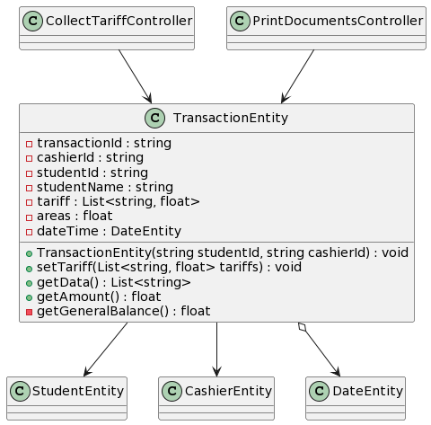

[🢀 Back to Analysis view](./analysis-view.md)

[-> Go to UseCase analysis](./analysis-view.usecase.md)

Análisis de clases.

## Indice

- [Controllers](#control)
    - [CollectTariffController](#control1)
    - [EnrollStudentController](#control2)
    - [CreateOfficialEnrollmentController](#control3)
    - [PrintingReceiptsController](#control4)
    - [MoveTeacherGuideFromEnrollmentController](#control5)
    - [PritingReportCardController](#control6)
- [Models](#model)
    - [TransactionEntity](#model1)

---

## Controllers 

* ### CollectTariffController 

* ### EnrollStudentController 

* ### CreateOfficialEnrollmentController 

* ### PrintingReceiptsController 

* ### MoveTeacherGuideFromEnrollmentController 

* ### PrintingReportCardController 

---
## Models 

* ### TransactionEntity 

