[🢀 Back to Analysis view](./analysis-view.md)

Análisis de clases.
Para la elaboración del análisis es necesario conocer los diagramas de colaboración de cada casos de uso.

* [Go to UseCase analysis 枸룋(./analysis-view.usecase.md)

## Indice

- [Controllers](#control)
    - [CollectTariffController](#control1)
    - [EnrollStudentController](#control2)
    - [CreateOfficialEnrollmentController](#control3)
    - [PrintingReceiptsController](#control4)
    - [MoveTeacherGuideFromEnrollmentController](#control5)
    - [PrintingReportCardController](#control6)
    - [CreateStudentProfileController](#control7)
    - [PayTariffController](#control8)
- [Models](#model)
    - [TransactionEntity](#model1)
    - [StudentEntities](#model2)
    - [StudentEntity](#model3)
    - [CashierEntity](#model4)
    - [GradeEntity](#model5)
    - [EnrollmentEntity](#model6)
    - [SubjectEntities](#model7)
    - [TeacherEntities](#model8)
    - [TeacherEntity](#model9)
    - [GradeEntities](#model10)
    - [UserEntity](#model11)
---

## Controllers 

* ### CollectTariffController 

* ### EnrollStudentController 

* ### CreateOfficialEnrollmentController 

* ### PrintingReceiptsController 

* ### MoveTeacherGuideFromEnrollmentController 

* ### PrintingReportCardController 

* ### CreateStudentProfileController 
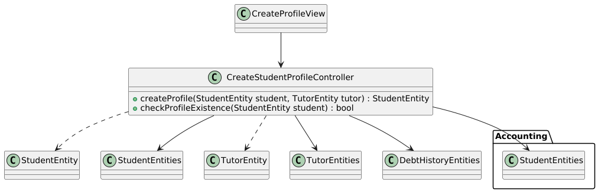

* ### PayTariffController 
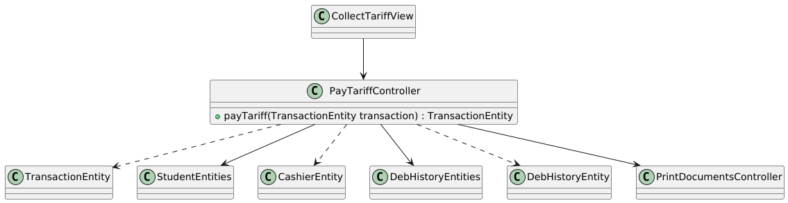

---
## Models 

* ### TransactionEntity 

* ### StudentEntities 
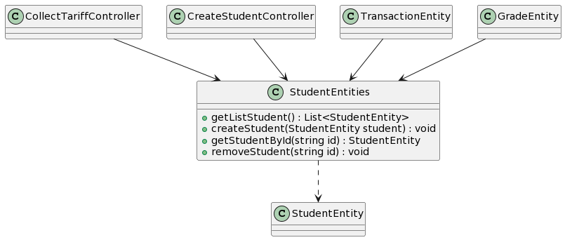

* ### StudentEntity 
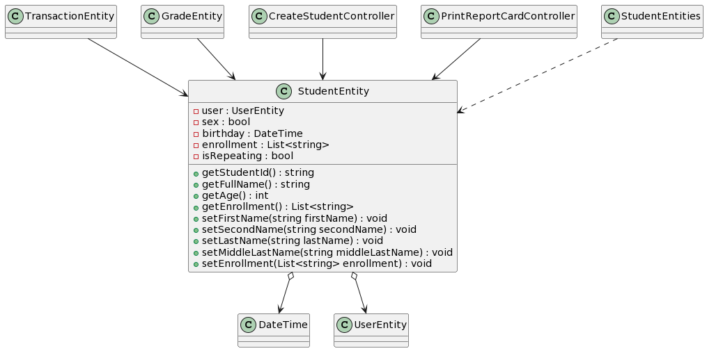

* ### CashierEntity 
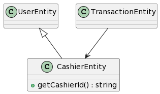

* ### GradeEntity 
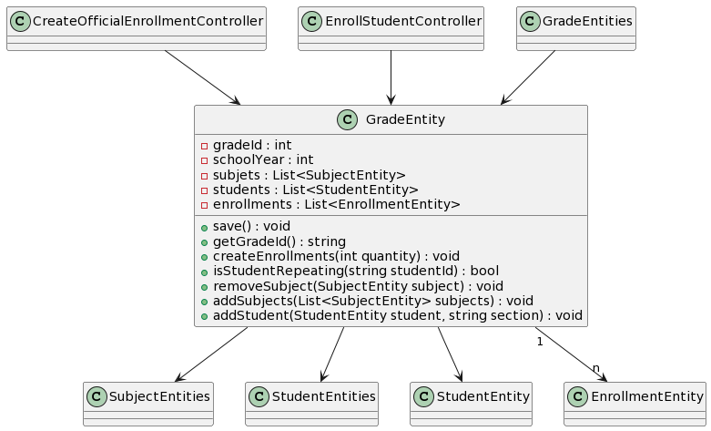

* ### EnrollmentEntity 
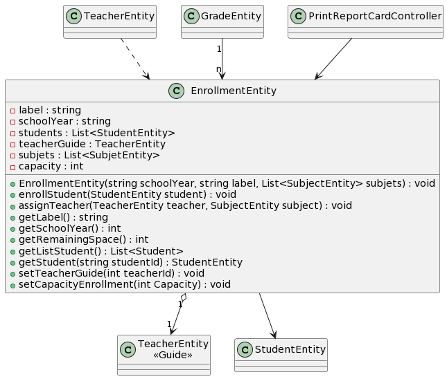

* ### SubjectEntities 
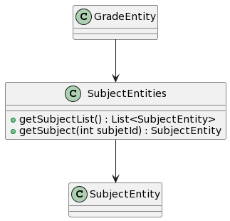

* ### TeacherEntities 

* ### TeacherEntity 
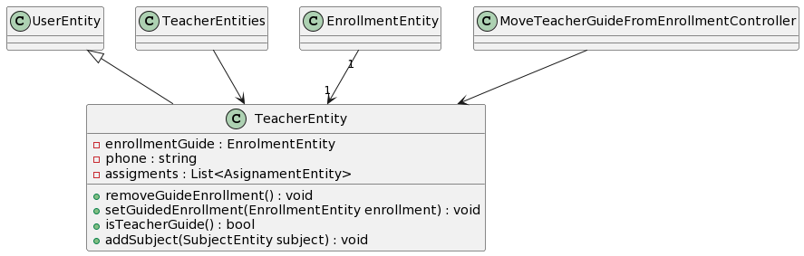

* ### GradeEntities 
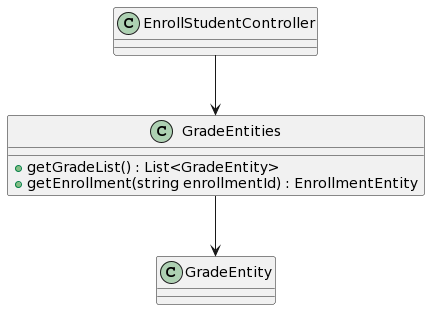

* ### UserEntity 
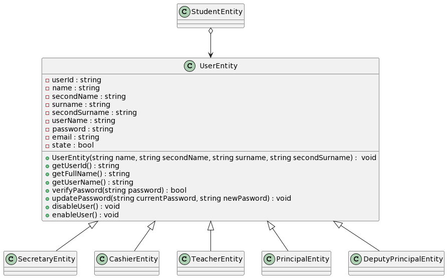