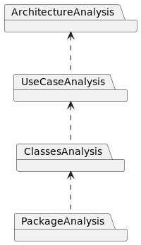
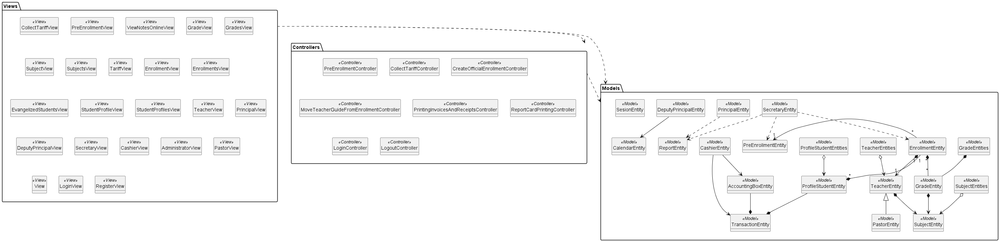
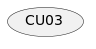

[🢀 Back to Design view](./design-view.md)

# Analysis view
Índice general de la vista de Análisis, se muestran los componente/artefactos que la componen.
Se muestran las dependencias entre cada componente y como se relacionan.

## Architecture analysis

## Use case analysis

Página donde se muestran el análisis de los casos de usos, donde se presenta los distintos diagramas clases.

[See Use case analysis ⮞](./analysis-view.usecase.md)

Trazabilidad de "Caso de uso x analisis"

## Classes analysis

## Package analysis