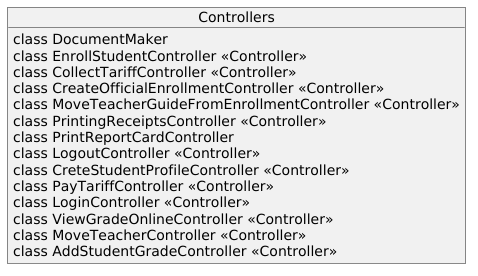
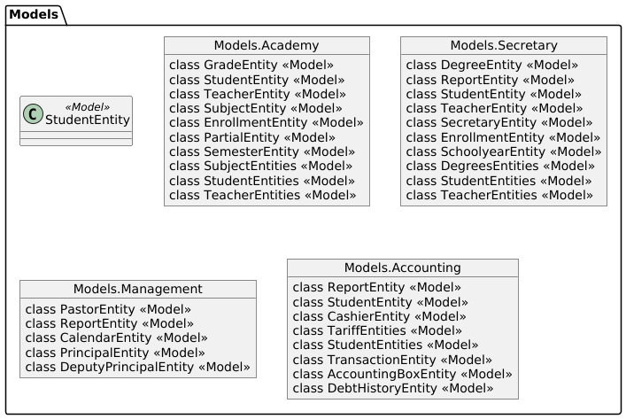

[🢀 Back to Design view](./design-view.md)

# Analysis view 
Índice general de la vista de Análisis, se muestran los componentes/artefactos que la componen.
Se muestran las dependencias entre cada componente y como se relacionan.

- [Architecture analysis](#architecture-analysis)
- [Use case analysis](#use-case-analysis)
- [Classes analysis](#classes-analysis)
- [Package analysis](#package-analysis)
---
    
## Architecture analysis 

### Dependencies

### Views

### Controllers

### Models

## Use case analysis 

Página donde se muestran el análisis de los casos de usos, donde se presenta los distintos diagramas clases.
* [see Use case analysis ⮞](./analysis-view.usecase.md)

## Classes analysis 

## Package analysis 