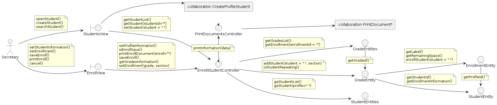

[🢀 Back to Analysis view](./analysis-view.md)

# Indice
- [CU03. CollectTariffs](#cu03)
- [CU01. EnrollStudent](#cu01)
- [CU05. CreateOfficialEnrollmentBySection](#cu01)
- [CU29. PrintReportCardByStudent](#cu29)

---

## CU03. CollectTariffs 
### 1. Classes

### 2. Collaboration

## CU05. CreateOfficialEnrollmentBySection 
### 1. Classes

### 2. Collaboration

## CU01. EnrollStudent 
### 1. Classes

### 2. Collaboration

## CU29. PrintReportCardByStudent 
### 1. Classes

### 2. Collaboration
