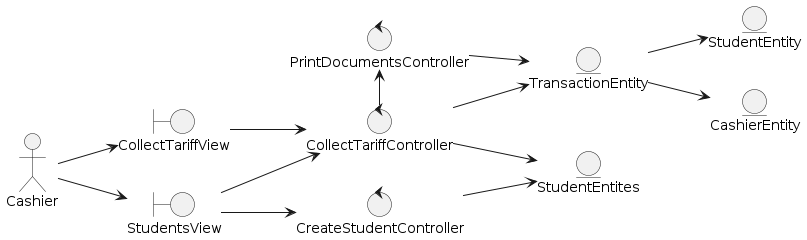

[🢀 Back to Analysis view](./analysis-view.md)

# Indice
- [CU03. CollectTariffs](#cu03)
- [CU05. blablabla](#cu05)

---

## CU03. CollectTariffs 

### 1. Classes

### 2. Collaboration

## CU05. CreateOfficialEnrollmentBySection

### 1. Classes

### 2. Collaboration
