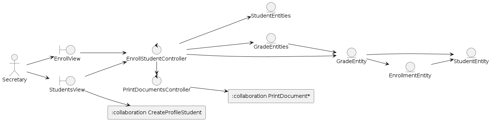
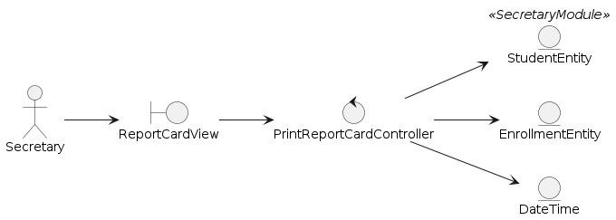
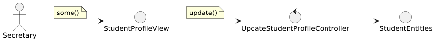
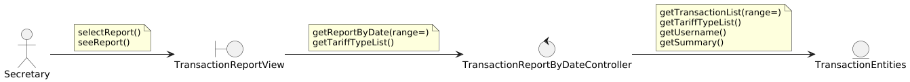

[🢀 Back to Analysis view](./analysis-view.md)

El detallado de las clases de estos casos de usos están en la carpeta de Análisis de Clases.
* [Go to Classes analysis ⮞](./analysis-view.class.md)

## Indice

---
- [CU03. CollectTariffs](#cu03)
- [CU05. CreateOfficialEnrollmentBySection](#cu05)
- [CU01. EnrollStudent](#cu01)
- [CU58. PrintingReceipts](#cu58)
- [CU29. PrintReportCardByStudent](#cu29)
- [CU21. MoveTeacherGuideFromEnrollment](#cu21)
---
- [CU02. CreateStudentProfile](#cu02)
- [CU60. PayTariff](#cu60)
- [CU11. AddStudentGrade](#cu11)
---
- [CU15. ViewGradeOnline](#cu15)
- [CU16. UpdateStudentProfile](#cu16)
- [CU22. MoveTeacher](#cu22)
- [CU23. MoveStudentFromEnrollment](#cu23)
- [CU73. CancelTransaction](#cu73)
- [CU75. TransactionReportByDate](#cu75)

## Iteration 1

---

### CU03. CollectTariffs 
* ### Classes

* ### Collaboration

### CU05. CreateOfficialEnrollmentBySection 
* ### Classes

* ### Collaboration

### CU01. EnrollStudent 
* ### Classes

* ### Collaboration

### CU58. PrintingReceipts 
* ### Classes

* ### Collaboration

### CU29. PrintReportCardByStudent 
* ### Classes

* ### Collaboration

### CU21. MoveTeacherGuideFromEnrollment 
* ### Classes

* ### Collaboration

## Iteration 2

---

### CU02. CreateStudentProfile 
* ### Classes

* ### Collaboration

### CU60. PayTariff 
* ### Classes

* ### Collaboration

### CU11. AddStudentGrade 
* ### Classes

* ### Collaboration

## Iteration 3

---

### CU15. ViewGradeOnline 
* ### Classes

* ### Collaboration

### CU16. UpdateStudentProfile 
* ### Classes

* ### Collaboration

### CU22. MoveTeacher 
* ### Classes

* ### Collaboration

### CU23. MoveStudentFromEnrollment 
* ### Classes

* ### Collaboration

### CU73. CancelTransaction 
* ### Classes

* ### Collaboration

### CU75. TransactionReportByDate 
* ### Classes

* ### Collaboration
