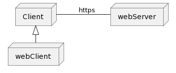
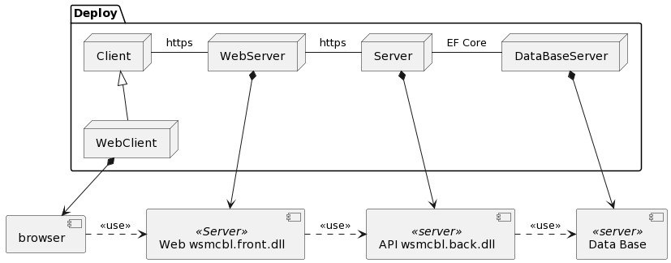
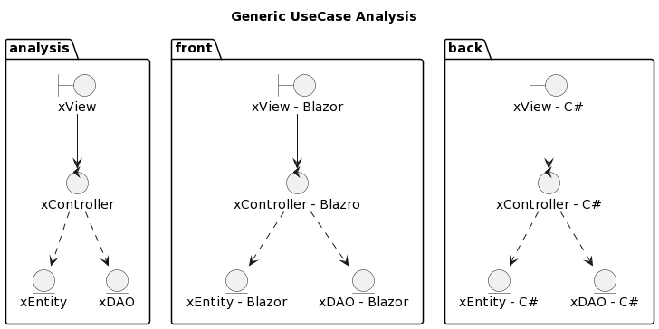

[🢀 Back to Main index](../README.md)

# Design view
Índice general de la vista de Diseño, se muestran los componente/artefactos que la componen.
Se muestran las dependencias entre cada componente y como se relacionan.

- [Analysis view](#analysis-view)
- [Architecture Design](#architecture-design)
- [Use Case Design](#usecase-design)
- [Data base Design](#database-design)

---

## Analysis View 
Carpeta de la vista de análisis, se muestra el diseño preliminar del software.
* [see Analysis view ⮞](./analysis-view.md)

## Architecture Design 
* ### Deploy View

* ### TRACES Components x Nodes

## UseCase Design 
### Generic UseCase

## Classes Design
## Package Design

## Data Base Design  
WSM CBL Database
