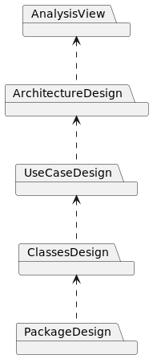

[🢀 Back to Main index](./main-index.md)

# Design view
Índice general de la vista de Diseño, se muestran los componente/artefactos que la componen.
Se muestran las dependencias entre cada componente y como se relacionan.

## Analysis View
Carpeta de la vista de análisis, se muestra el diseño preliminar del software,
[see Analysis view ⮞](./analysis-view.md).

## Architecture Design
## UseCase Design
## Classes Design
## Package Design