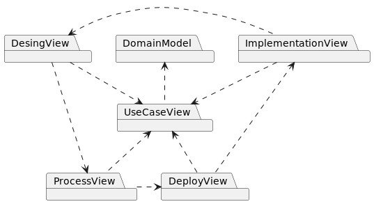
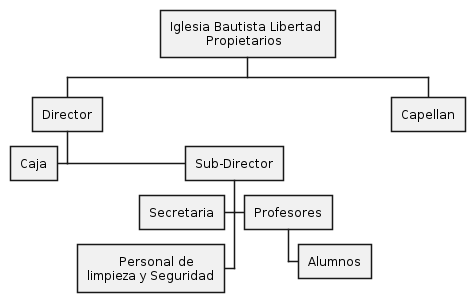

# Main index

Modelo de documentación de proyecto, siguiendo el modelo "4 + 1 vista",

* [Use Case View ⮞](./usecase-view.md)

* [Design View ⮞](./design-view.md)

## 1. Domain model
Sección donde se muestran los datos relevantes del modelo del dominio.

### 1.1 Organigrama

### 1.2 Modelo del negocio

## 2. Ecosystem

