[🢀 Back to Main index](../README.md)

# Use Case View
Índice general de la vista de caso de uso, se muestran los componente/artefactos que la componen. 
Se muestran las dependencias entre cada componente y como se relacionan.

- [Actors](#actors)
- [Requisites](#requisites)
- [Use Case Model](#use-case-model)
- [Context](#context)
- [Use Case Prioritization](#use-case-prioritization)
- [UI Prototype](#ui-prototype)
- [TRACE Requisites x Use Case](#trace-requisites-x-use-case)
- [TRACE Use Case x Prototype](#trace-use-case-x-prototype)
- [TRACE State x Prototype](#trace-state-x-prototype)

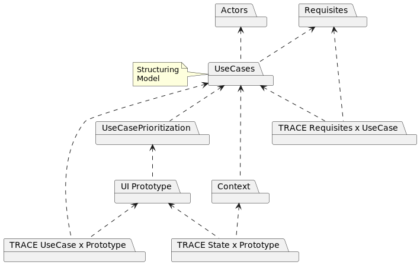

---

## Actors 
Diagrama de todos los actores del sistema.

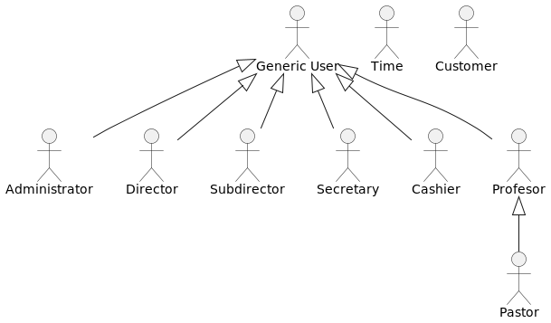

## Requisites 
Requisitos del sistema, aquí se muestran algunos de los requisitos, en particular los tratados en las iteraciones del desarrollo.

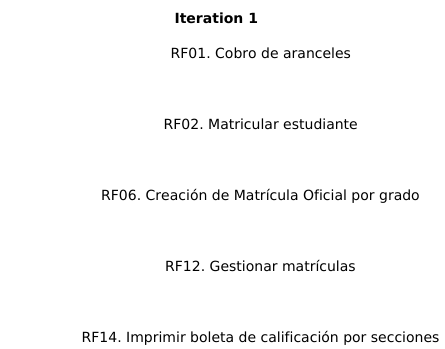
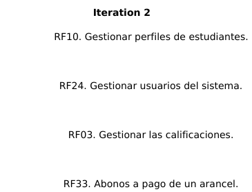
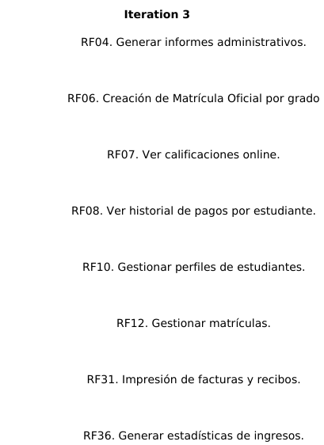
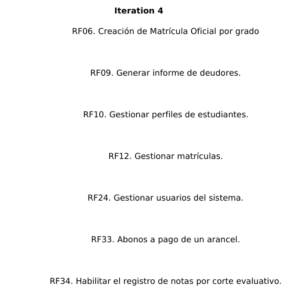
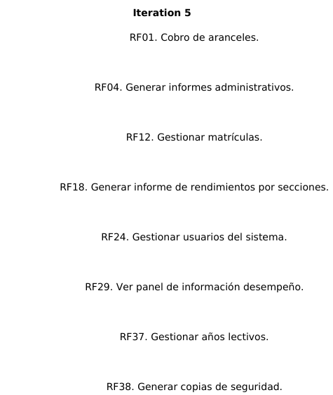
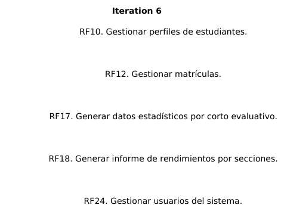
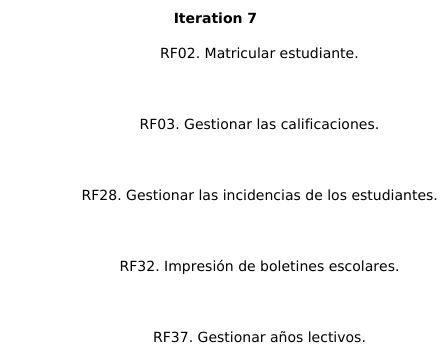

### Use Case Model 
Modelo de los casos de uso, donde se muestran los actores y sus distintos casos de uso.
Luego se hará la estructuración de los casos de uso en este mismo diagrama, el cual tiene como objetivo extraer la subsecuencia repetidas.

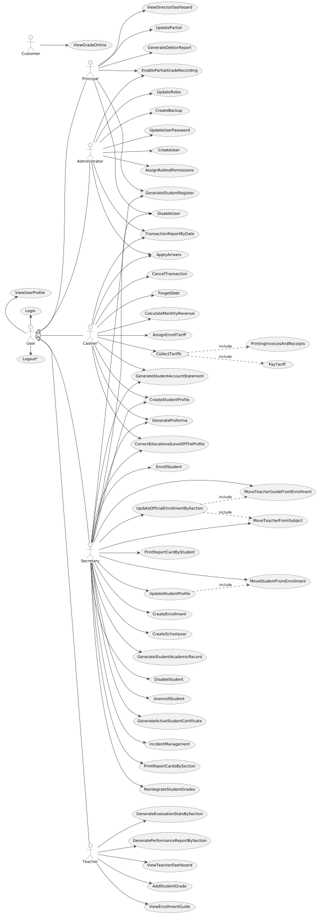

### Context 
Diagrama que describe de manera general el contexto de cada caso de uso.
Además se muestran los distintos estados ociosos del sistema.

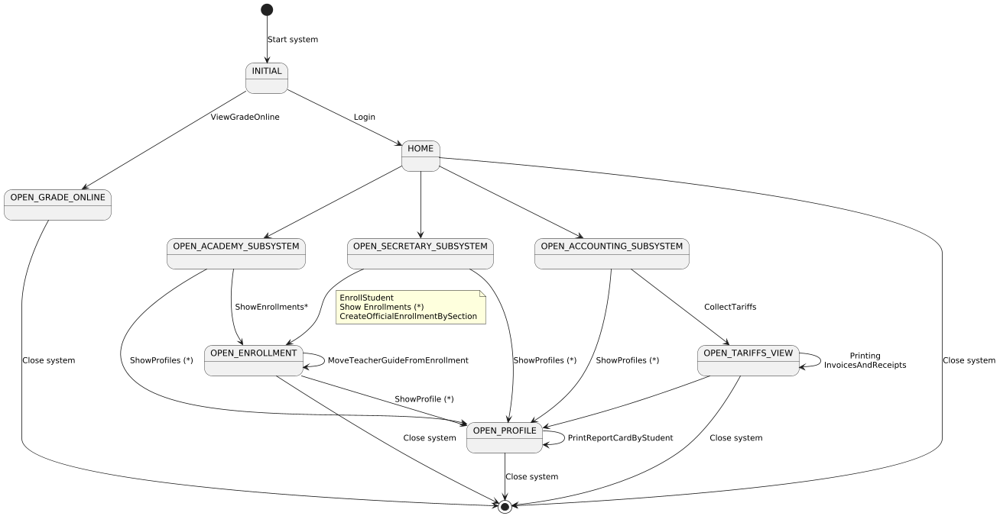

### Use Case Prioritization 
Casos de uso selecionados en cada iteración.

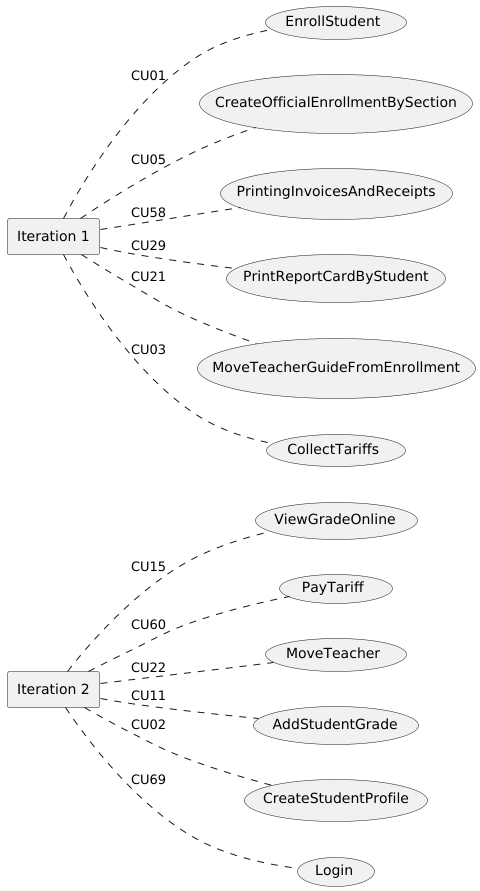

### UI Prototype 
Página donde se muestran los prototipos de interfaces de usuarios que dan continuidad al desarrollo de los casos de usos.
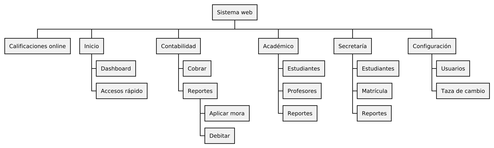

* [see prototypes ⮞](./usecase-view.prototypes.md)

### TRACE Requisites x Use Case 
Trazabilidad de "Requisitos x Casos de uso"

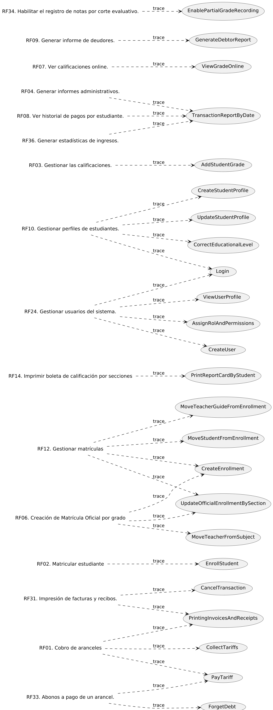

### TRACE Use Case x Prototype 
Trazabilidad de "Casos de uso x Prototipos de interfaces"

### TRACE State x Prototype 
Trazabilidad de "Casos de uso x Estados", donde los Estados son los momentos donde el sistema se encuentra ocioso.

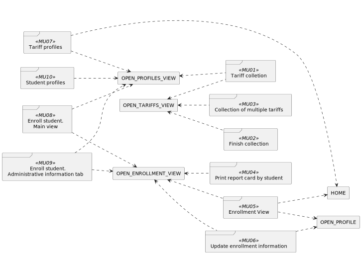

