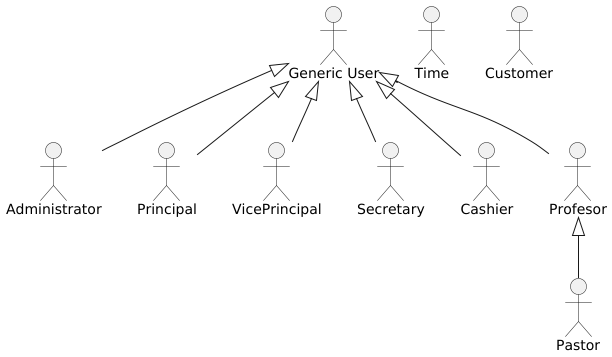
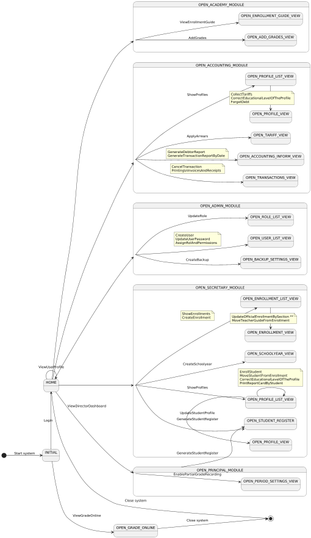
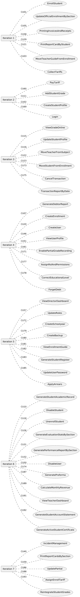
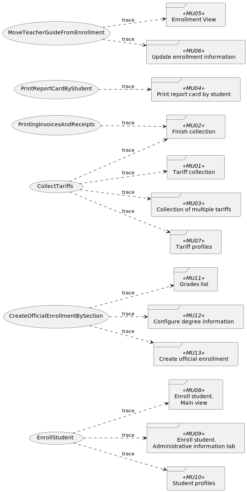
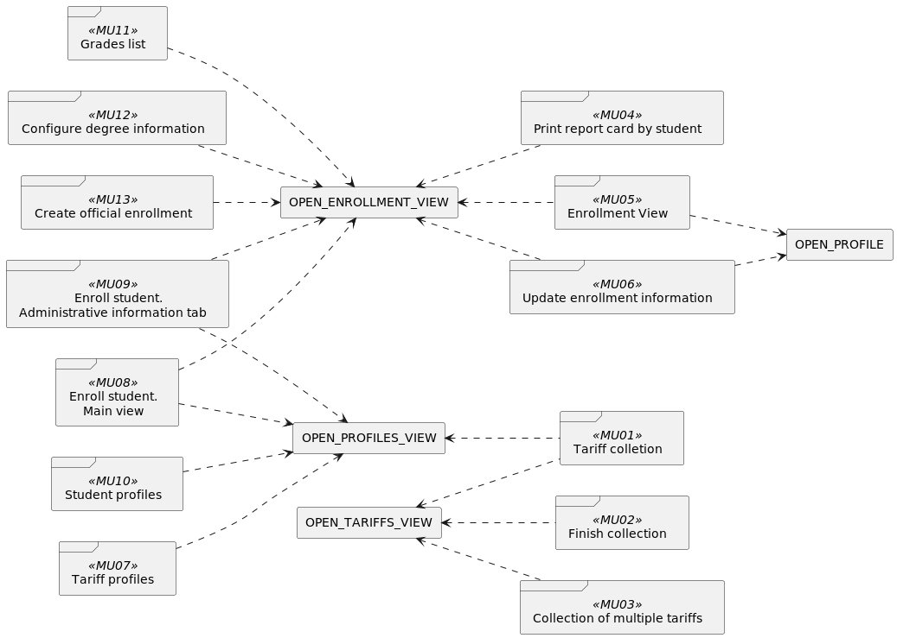

[<== Back to Main index](./main-index.md)

# Use Case View
Índice general de la vista de caso de uso, se muestran los componente/artefactos que la componen. 
Se muestran las dependencias entre cada componente y como se relacionan.

## Actors
Diagrama de todos los actores del sistema.

## Requisites
Requisistos del sistema, aquí se muestran algunos de los requisitos, en particular los tratados en las iteraciones del desarrollo.

### Use Case Model
Modelo de los casos de uso, donde se muestran los actores y sus distintos casos de uso.
Luego se hará la estructuración de los casos de uso en este mismo diagrama, el cual tiene como objetivo extraer la subsecuencia repetidas.

### Context
Diagrama que describe de manera general el contexto de cada caso de uso.
Además se muestran los distintos estados ociosos del sistema.

### Use Case Prioritization
Casos de uso selecionados en cada iteración.

### UI Prototype
Página donde se muestran los prototipos de interfaces de usuarios que dan continuidad al desarrollo de los casos de usos.

[See prototypes =>>](./prototypes.md)

### TRACE Requisites x Use Case
Trazabilidad de "Requisitos x Casos de uso"

### TRACE Use Case x Prototype
Trazabilidad de "Casos de uso x Prototipos de interfaces"

### TRACE State x Prototype
Trazabilidad de "Casos de uso x Estados", donde los Estados son los momentos donde el sistema se encuentra ocioso.

