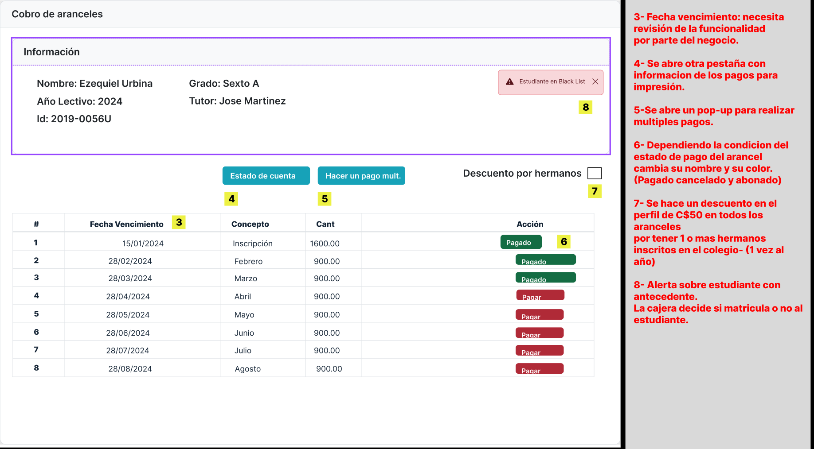
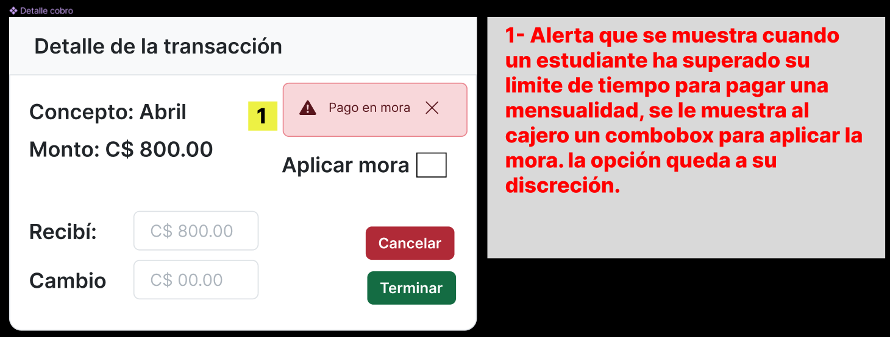
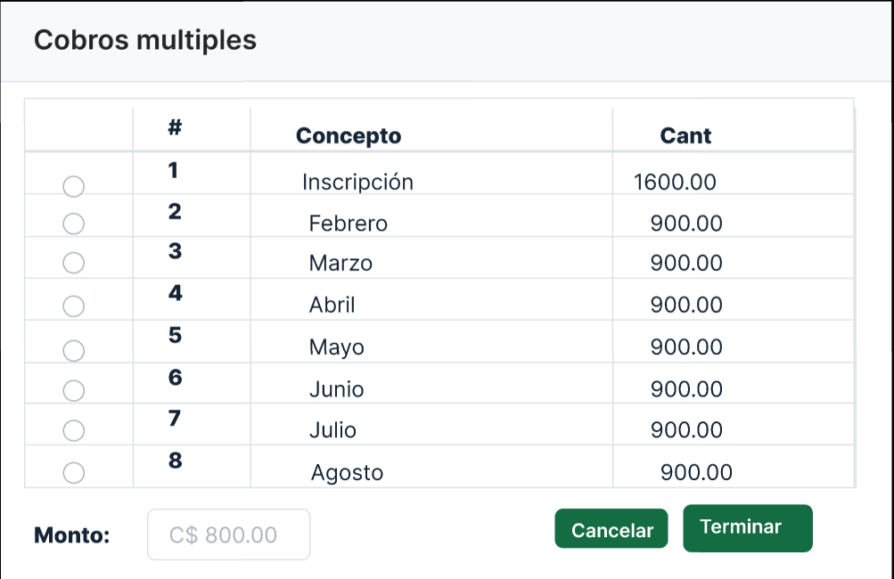
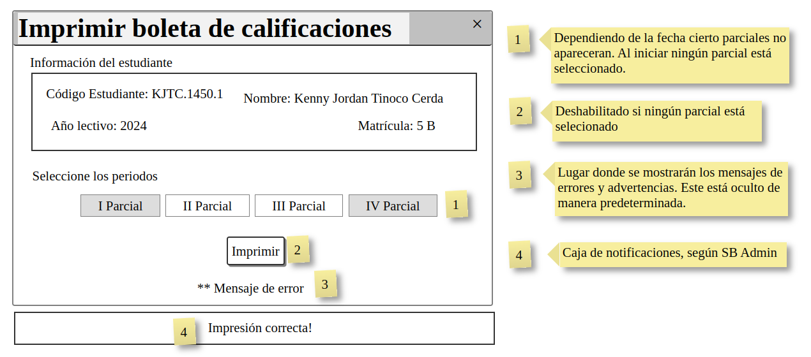
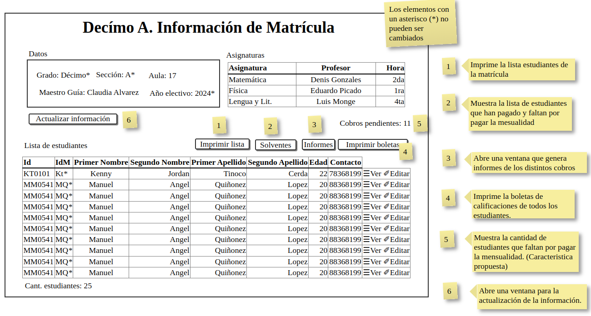
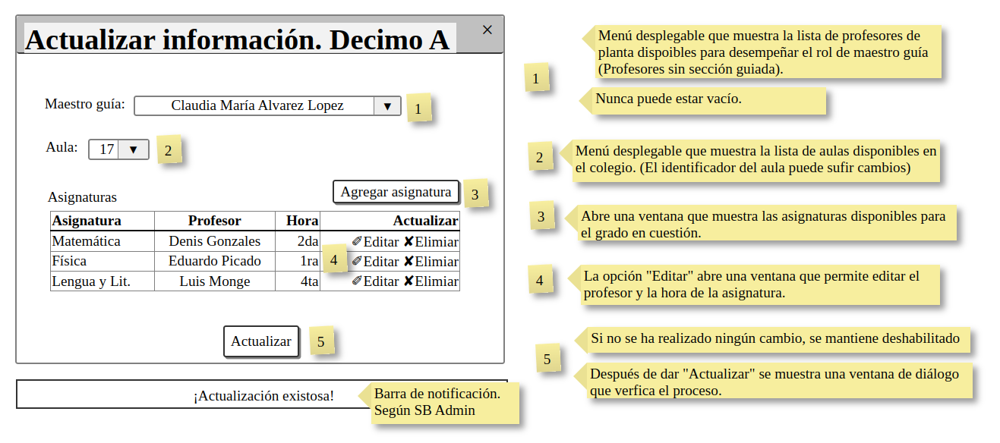
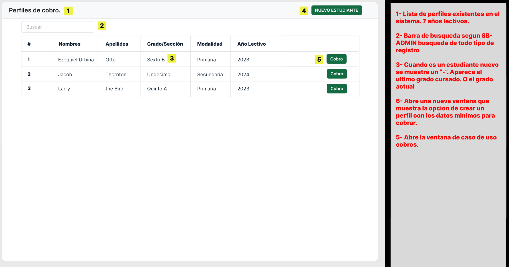
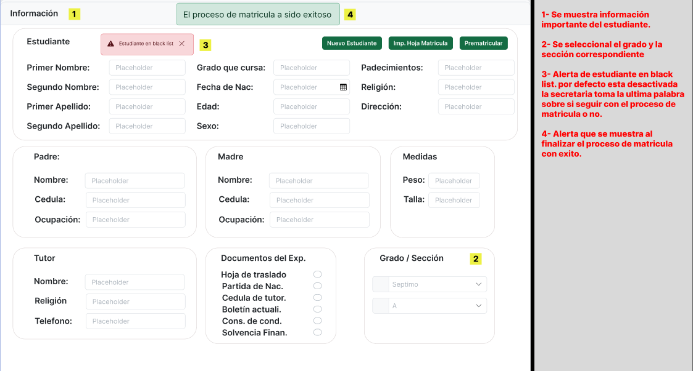

[🢀 Back to Use Case View](./usecase-view.md)

# Prototypes (MockUp)

Prototipos de interfaces de usario.
Los prototipos 04, 05 y 06 se realizaron con la herramienta [quickMockup](https://jdittrich.github.io/quickMockup/).

### MU01. Tariff colletion

### MU02. Finish collection

### MU03. Collection of multiple tariffs

### MU04. Print report card by student

### MU05. Enrollment View

### MU06. Update enrollment information

### MU07. Tariff profiles

### MU07. Errol student

### MU07. Student profiles
