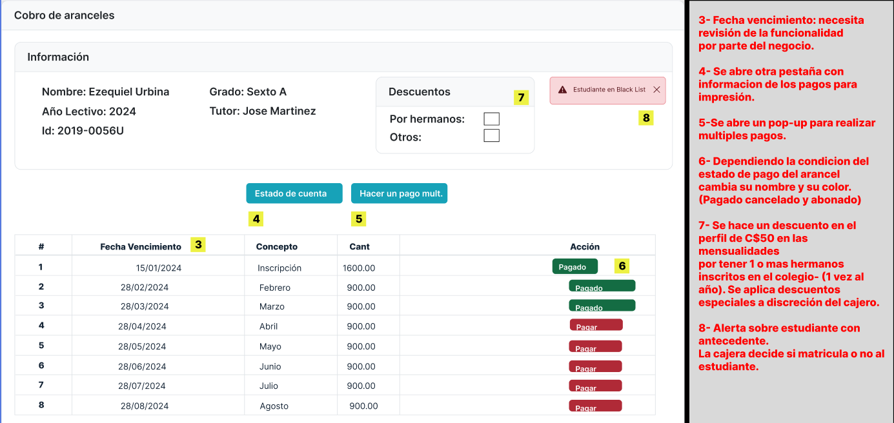
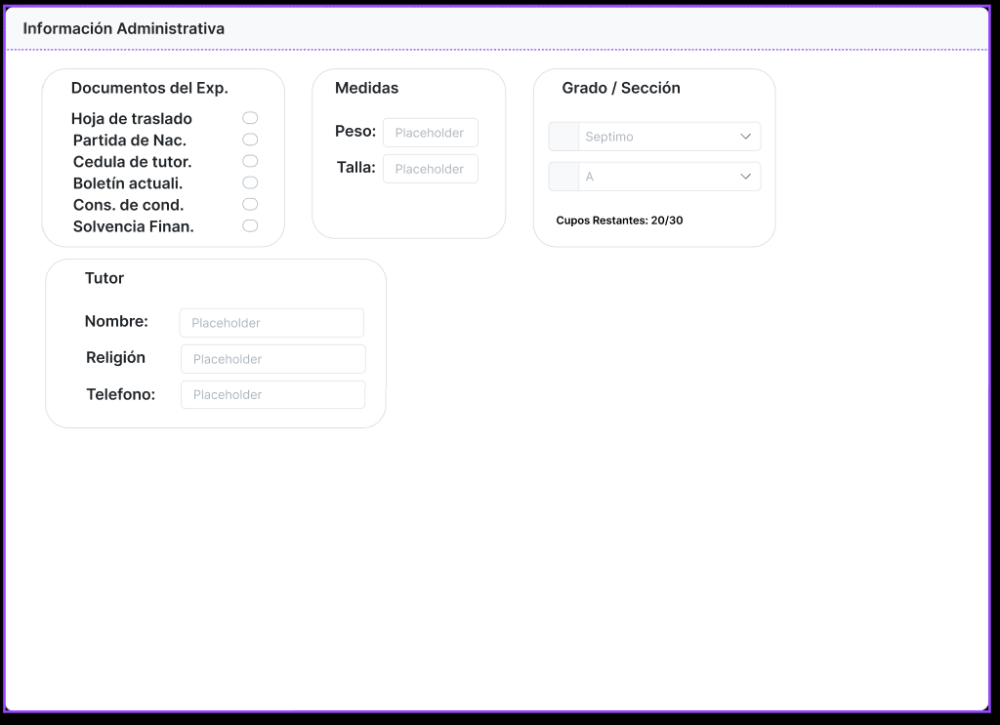

[🢀 Back to Use Case View](./usecase-view.md)

# Prototypes (MockUp)

Prototipos de interfaces de usario.
Los prototipos 04, 05 y 06 se realizaron con la herramienta [quickMockup](https://jdittrich.github.io/quickMockup/).

## Índice
- [MU01. Tariff collection](#mu01)
- [MU02. Finish collection](#mu02)
- [MU03. Collection of multiple tariffs](#mu03)
- [MU04. Print report card by student](#mu04)
- [MU05. Enrollment View](#mu05)
- [MU06. Update enrollment information](#mu06)
- [MU07. Tariff profiles](#mu07)
- [MU08. Enroll student. Main view](#mu08)
- [MU09. Enroll student. Administrative information tab](#mu09)
- [MU10. Student profiles](#mu10)
- [MU11. Grades list](#mu11)
- [MU12. Configure degree information](#mu12)
- [MU13. Create official enrollment](#mu13)
- [MU14. Teacher enrollments list](#mu14)
- [MU15. Add grades for students](#mu15)
---

### MU01. Tariff collection 

### MU02. Finish collection 

### MU03. Collection of multiple tariffs 

### MU04. Print report card by student 

### MU05. Enrollment View 

### MU06. Update enrollment information 

### MU07. Tariff profiles 

### MU08. Enroll student. Main view 

### MU09. Enroll student. Administrative information tab 

### MU10. Student profiles 

### MU11. Grades list 

### MU12. Configure degree information 

### MU13. Create official enrollment 

### MU14. Teacher enrollments list 

### MU15. Add grades for students 
